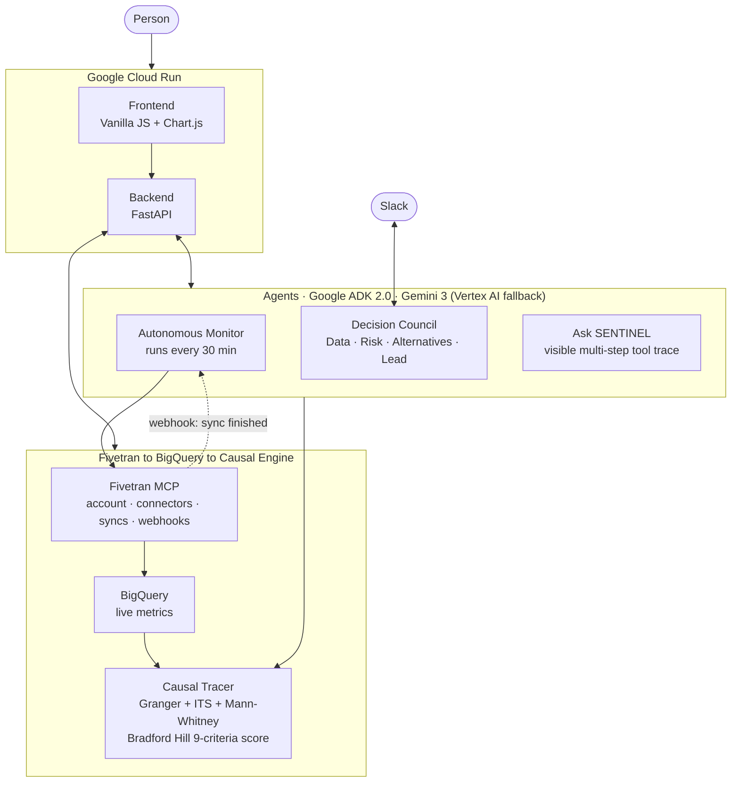

# SENTINEL: The Business Flight Recorder

Post a business decision in Slack. SENTINEL pulls your live Fivetran metrics, convenes four AI agents to argue about it in the open, and then keeps a permanent, timestamped record of both the decision and the data behind it. Months later, if the outcome goes wrong, it can run three statistical tests plus Bradford Hill (a causal-evidence framework borrowed from 1965 epidemiology) to check whether that decision actually caused what happened, or whether you're just looking at a coincidence.

[](LICENSE)
[](https://github.com/google/adk-python)
[](https://ai.google.dev)
[](https://github.com/fivetran/fivetran-mcp)
[](https://fastapi.tiangolo.com)
[](https://sentinel-38381883054.us-central1.run.app)

Most companies can tell you *what* happened to a metric. Almost none can tell you *why*, because by the time a number moves, the meeting where someone decided to raise prices or cut a feature is months and several reorgs in the past, and nobody wrote down what the data looked like that day. SENTINEL exists to make that conversation always possible: it watches your data continuously, catches the moment a decision gets made, and keeps a permanent record of both, so when something breaks later, you can actually go back and check.

---

## Architecture



Three loops run continuously and all draw on the same memory: an autonomous monitor that watches your Fivetran-synced metrics every 30 minutes and raises warnings before anyone has to ask, a Slack-based Decision Council where four Gemini agents debate a decision out loud before it's made, and a causal tracer that, when an outcome goes wrong, checks whether a logged decision actually explains it.

→ [Full architecture walkthrough](docs/architecture.md) · [Why we built it this way](docs/adr/) · [Connecting to Google Cloud Agent Builder](AGENT_BUILDER.md)

---

## What it does

| Stage | What actually happens |
|---|---|
| 1. Watch | Every 30 minutes, and instantly on a Fivetran webhook, SENTINEL pulls fresh metrics from BigQuery and checks them against known warning patterns |
| 2. Warn | If something looks wrong, it posts to Slack with a drafted action plan, stakeholder emails included, before a human notices |
| 3. Listen | When someone posts a decision in Slack ("raising prices 20%..."), SENTINEL recognizes it and pulls the metrics that matter right now |
| 4. Debate | Four Gemini agents (Data, Risk, Alternatives, Lead) argue the decision out loud in the same thread, usually within 60 seconds |
| 5. Record | The decision is logged with a full, timestamped snapshot of every metric that mattered at that moment, permanently |
| 6. Trace | Months later, if an outcome goes wrong, SENTINEL runs three statistical tests plus Bradford Hill scoring to check whether a logged decision actually explains it |

---

## What you get

- **Decision recording with live context**: every logged decision carries a full snapshot of NPS, churn, MRR, ARR (or whatever your Fivetran tables track) at the exact moment it was made
- **Multi-agent Slack council**: four Gemini agents debate every detected decision before it's final, visibly, in the same channel
- **Impact Trace**: full causal reconstruction with an animated time series, three independent statistical tests, Bradford Hill scoring, industry benchmark percentiles, and Gemini-generated alternative explanations, so correlation never gets mistaken for proof
- **Pre-decision risk check**: type out a decision before making it and get a live risk score with specific, data-backed objections as you type
- **Autonomous monitoring**: a 30-minute loop, plus instant webhook reactions, that pulls fresh data, runs pattern analysis, and raises warnings with drafted stakeholder emails. No human has to trigger it
- **Ask SENTINEL**: a conversational agent that answers questions about your decision history and shows its full multi-step reasoning chain, not just a final answer
- **Transcript extraction**: paste a meeting transcript or Slack thread and Gemini pulls out every decision worth logging automatically
- **Full Fivetran platform control**: a dashboard tab that drives account, group, connector, destination, and webhook management through eleven separate MCP tools, live
- **Bidirectional Fivetran integration**: SENTINEL doesn't just call Fivetran, it also receives webhook events back (HMAC-SHA256 verified) and reacts to them instantly
- **Honest liveness reporting**: every integration self-reports whether it's live, configured, or running on demo data, so the UI never overclaims

---

## Stack

| Layer | What's running |
|---|---|
| Agent framework | [Google ADK 2.0](https://github.com/google/adk-python): code-first agents with `FunctionTool`, returning a visible multi-step `tool_trace` |
| Primary model | Gemini 3 (`gemini-3-flash-preview`) by API key, through Google AI Studio |
| Fallback model | Gemini 2.5 Pro / Flash on Vertex AI, automatic and self-reporting, used only when Gemini 3's quota runs out |
| Data sync | [Fivetran MCP](https://github.com/fivetran/fivetran-mcp) (stdio transport): 11 platform tools spanning account, groups, connectors, destinations, and webhooks |
| Data warehouse | Google BigQuery |
| Backend | FastAPI + Python 3.13, fully async |
| Frontend | Vanilla JS + Chart.js. No framework, no build step |
| Database | MongoDB Atlas (decisions, warnings, sessions) |
| Notifications | Slack Events API + Bot |
| Scheduling | APScheduler, running the 30-minute autonomous loop |
| Statistics | scipy + statsmodels: Granger F-test, ITS regression, Mann-Whitney U |
| Hosting | Google Cloud Run (us-central1), scales with traffic |

---

## Causal analysis: how it actually works

This is the part that makes SENTINEL different from a normal dashboard. When you ask "did this decision cause that outcome," it doesn't show you a correlation and call it a day.

**Three independent statistical tests, run in parallel:**

1. **Granger causality** (lag-1 F-test): does decision timing help predict the metric's later movement better than chance?
2. **Interrupted time series**: did the metric's trend change right at the decision date, like a step, rather than drifting gradually?
3. **Mann-Whitney U**: are the "before" and "after" values genuinely different distributions, or just noise that happens to look different?

Each test runs and reports independently. SENTINEL shows all three, not a blended average, because three methods agreeing is much stronger evidence than any one of them alone (and if they disagree, that's worth knowing too).

**Then, Bradford Hill scoring (1965):**

Nine criteria, originally built for arguing that smoking causes cancer, applied here, as far as we know for the first time, to ordinary business decisions:

| # | Criterion | What SENTINEL checks |
|---|-----------|---------------------|
| 1 | Strength | Effect size against baseline variance |
| 2 | Consistency | Does the pattern reproduce across all three statistical methods? |
| 3 | Specificity | Does the timing line up specifically with this decision, and not something else? |
| 4 | Temporality | Does the decision provably come before the outcome? |
| 5 | Dose-response | Does a bigger decision produce a bigger effect? |
| 6 | Plausibility | Is there a sensible business mechanism connecting the two? |
| 7 | Coherence | Is this consistent with the rest of the historical data? |
| 8 | Experiment | Is there a natural experiment or reversal to compare against? |
| 9 | Analogy | Have similar past decisions produced similar outcomes? |

A criterion counts as "met" at a score of 0.7 or higher. The total is the mean of all nine: **0.75 or above is "Strong,"** **0.55 is "Moderate,"** **0.35 is "Weak,"** and below that is "Insufficient."

*(The live AcmeSaaS trace, built from a real Fivetran-to-BigQuery sync, currently scores 0.839: 7 of 9 criteria met, "Strong," with all three statistical tests agreeing. That's not a scripted number. It's what the running demo actually returns right now.)*

**And, for context, real industry benchmarks:**

| Metric | Source | p10 | Median | p75 | p90 |
|--------|--------|-----|--------|-----|-----|
| NPS | Medallia B2B SaaS 2024 (n = 2,847) | 14 | 44 | 68 | 80 |
| Churn rate | ChurnZero SaaS 2023 (n = 1,200) | 2.5% | 6.5% | 12% | 18% |

---

## Try it without an account

Two fully playable scenarios, both backed by live BigQuery data. Click **Explore Demo** on the homepage to walk through either one. No login, no setup.

| Scenario | The decision | What happened | Bradford Hill | The warning |
|----------|----------|---------|---------------|---------|
| **AcmeSaaS** | Raise prices 20% while NPS sits at 31 | Churn hit 17%; $120K of ARR gone | 7/9 · 84% | The data showed it coming 34 days early |
| **Netflix Qwikster** | A 60% price hike plus splitting the service in two | 800K subscribers left; stock fell 77% | 7/9 · 81% | The signal was there before the announcement |

---

## Setup

### What you need

- Python 3.11+
- A [Google AI Studio API key](https://aistudio.google.com) for Gemini 3 (the free tier caps at 20 requests a day, fine for trying it out, worth upgrading for real use)
- A Google Cloud project with BigQuery enabled, if you want to connect live data instead of using the demo scenarios
- A MongoDB Atlas connection string (the free tier works)

### Configure

```bash
git clone https://github.com/usv240/sentinel-flight-recorder
cd sentinel-flight-recorder/sentinel
pip install -r requirements.txt
cp .env.example .env
```

```env
GEMINI_API_KEY=your-ai-studio-api-key
GEMINI_MODEL=gemini-3-flash-preview
GOOGLE_PROJECT_ID=your-gcp-project-id
MONGODB_URI=your-mongodb-atlas-connection-string

# Optional: connect your own Fivetran data
FIVETRAN_API_KEY=...
FIVETRAN_API_SECRET=...
SENTINEL_BQ_ACMESAAS_TABLE=google_sheets.acmesaas_metrics

# Optional: turns on the Slack Decision Council and autonomous alerts
SLACK_BOT_TOKEN=xoxb-...
SLACK_CHANNEL_ID=C0...
```

### Run

```bash
python -m uvicorn backend.main:app --host 0.0.0.0 --port 8101 --reload
```

Open [http://localhost:8101](http://localhost:8101) and click **Explore Demo**. Try AcmeSaaS or Netflix Qwikster.

### Connect your own Fivetran data

```bash
# 1. At fivetran.com, connect your data sources to a BigQuery destination
# 2. Clone the Fivetran MCP server alongside this project
git clone https://github.com/fivetran/fivetran-mcp ../fivetran-mcp
pip install -r ../fivetran-mcp/requirements.txt

# 3. Tell SENTINEL which BigQuery table to read
export SENTINEL_BQ_YOURAPP_TABLE=your_schema.your_metrics_table

# 4. Run it
python -m uvicorn backend.main:app --reload --port 8101
```

`/api/connectors/list` will then show your real connector next to the demo ones, and every snapshot pulled from it is live, not cached.

---

## Deploy to Cloud Run

```powershell
# From the sentinel/ directory, on Windows
.\deploy.ps1
```

```bash
# Or by hand, anywhere
gcloud builds submit --tag gcr.io/YOUR_PROJECT/sentinel .
gcloud run deploy sentinel \
  --image gcr.io/YOUR_PROJECT/sentinel \
  --region us-central1 \
  --platform managed \
  --allow-unauthenticated \
  --memory 1Gi \
  --timeout 300 \
  --env-vars-file env-cloud.yaml
```

`env-cloud.yaml` holds your real credentials and stays out of git. At minimum it needs `GEMINI_API_KEY`, `GOOGLE_PROJECT_ID`, `MONGODB_URI`, and `GEMINI_MODEL`.

---

## Is it actually live, or running on demo data?

SENTINEL never shows you mock data while pretending it's real. You can check for yourself:

```
GET /api/health/integrations
```

```jsonc
{
  "posture": "demo | partially_live | fully_live",
  "integrations": {
    "gemini":   { "status": "live|configured|demo|error", "active_model": "..." },
    "fivetran": { "status": "live|demo", "mode": "mcp|rest|demo" },
    "bigquery": { "status": "live|configured|demo|error", "row_count": 182 },
    "mongodb":  { "status": "live|demo|error" },
    "adk":      { "status": "live|unavailable" },
    "slack":    { "status": "configured|demo" }
  }
}
```

Every Fivetran result carries a `_source: mcp|rest|demo` tag and a `_live: true|false` flag. Every metrics snapshot names the BigQuery table it actually queried, or admits that it didn't query one. [ADR-0004](docs/adr/0004-honest-liveness-reporting.md) explains why this is built into the architecture rather than left as an afterthought.

To go from demo to fully live: add `GEMINI_API_KEY` (Gemini goes live on the first call), add `FIVETRAN_API_KEY` and `FIVETRAN_API_SECRET` (Fivetran switches to REST; adding `FIVETRAN_MCP_PATH` switches it to full MCP), point `SENTINEL_BQ_ACMESAAS_TABLE` at a table that's actually being synced (BigQuery goes live), and set `MONGODB_URI` (Mongo goes live). Once Fivetran and BigQuery are both live, the whole system reports `fully_live`.

---

## API reference

```
GET  /api/health                    Service status, active model, monitor state
GET  /api/health/integrations       Per-integration liveness: Gemini, Fivetran, BigQuery, Mongo, ADK, Slack
GET  /api/monitor/status            Last autonomous run and warnings detected
POST /api/monitor/run               Trigger a monitoring cycle right now
GET  /api/decisions/snapshot        Live Fivetran metrics snapshot
POST /api/decisions/log             Record a decision with a live snapshot attached
POST /api/decisions/precheck        Pre-decision risk check (fires as you type)
GET  /api/decisions/list            Every logged decision
GET  /api/warnings/active           Active early warnings
GET  /api/warnings/actions          Recent autonomous action plans
GET  /api/demo/{scenario}/full      Full trace: BigQuery, causal tests, Bradford Hill, benchmarks
POST /api/ask/                      Ask questions about decision history
POST /api/agent/chat                Chat with the ADK agent; returns a visible multi-step tool trace
POST /api/transcript/extract        Pull decisions out of a pasted transcript
POST /api/slack/events              Slack Events API endpoint

# Fivetran platform: the full MCP surface
GET  /api/connectors/platform       One call for account + groups + connectors + destinations + webhooks
GET  /api/connectors/list           Connectors merged with the BigQuery registry
GET  /api/connectors/account        Account info
GET  /api/connectors/groups         Groups, with drill-down into connections
GET  /api/connectors/destinations   Destinations
GET  /api/connectors/webhooks       Registered webhooks
GET  /api/connectors/{id}/history   Sync history for one connector
GET  /api/connectors/{id}/schema    Schema config for one connector
POST /api/connectors/{id}/sync      Trigger a sync through MCP

# Event-driven webhooks: Fivetran calls SENTINEL back
POST /api/fivetran/webhook          Receive Fivetran sync events (HMAC-SHA256 verified)
GET  /api/fivetran/webhook/recent   Recent inbound events

# MCP: SENTINEL as a server other agents can use
POST /api/mcp                       MCP Streamable HTTP transport (spec 2025-03-26)
GET  /api/tool-calls/recent         Live tool-call feed (polling)
GET  /api/tool-calls/stream         Live tool-call feed (SSE)
```

Interactive docs live at `/api/docs` in development mode.

---

## Tests

49 end-to-end tests, all making real calls: Gemini 3, BigQuery, Slack.

```bash
# Full suite (around 6 minutes)
python -m pytest tests/test_e2e.py -v

# Skip the tests that need a live Cloud Run deployment
python -m pytest tests/test_e2e.py -v -k "not live"
```

One test, `test_gemini3_model_active_is_gemini3`, skips gracefully once the free tier's daily quota of 20 requests is used up. That's quota, not a code failure.

---

## Project layout

```
sentinel/
├── backend/
│   ├── main.py                    # FastAPI app + autonomous scheduler startup
│   ├── routes/                    # demo, decisions, trace, ask, agent_chat, connectors,
│   │                              # fivetran_webhook, mcp_http, warnings, transcript...
│   └── services/
│       ├── gemini_client.py       # Gemini 3 + Vertex AI fallback (single source of truth)
│       ├── causal_tracer.py       # Granger + ITS + Mann-Whitney pipeline
│       ├── bradford_hill.py       # 9-criterion scoring
│       ├── bigquery_pipeline.py   # BigQuery queries + time series
│       ├── industry_benchmarks.py # Medallia / ChurnZero reference data
│       ├── slack_interceptor.py   # 4-agent Decision Council
│       ├── mcp_client.py          # Fivetran MCP stdio client
│       ├── precheck_engine.py     # Pre-decision risk scoring
│       ├── warning_engine.py      # Pattern detection
│       ├── diagnostics.py         # Honest per-integration liveness
│       └── monitor.py             # 30-minute autonomous loop
├── agent/
│   └── sentinel_agent.py          # Google ADK agent: visible multi-step tool trace
├── frontend/
│   ├── index.html                 # Single-page app
│   ├── app.js                     # All UI logic
│   └── style.css                  # Design system, light/dark themes, responsive layouts
├── docs/
│   ├── architecture.md            # Full system walkthrough + diagram
│   └── adr/                       # Why we built it this way
├── tests/
│   └── test_e2e.py                # 49 end-to-end tests
├── requirements.txt
├── Dockerfile
└── deploy.ps1
```

---

## A few honest caveats

The two demo scenarios (AcmeSaaS and Netflix Qwikster) are illustrative: built on realistic but constructed data so you can see the whole pipeline before connecting your own warehouse. Connect a real Fivetran source and the same pipeline runs on your real numbers.

Gemini's free tier caps at 20 requests a day, and SENTINEL makes several model calls per analysis (the council alone is four), so a paid AI Studio key is worth it for anything beyond a quick look.

Bradford Hill scoring is a strength-of-evidence framework, not a courtroom verdict. A "Strong" score means the available evidence consistently points the same way across independent tests. It's a reason to take a hypothesis seriously, not a guarantee that the decision is what caused the outcome, which is exactly why SENTINEL also surfaces alternative explanations alongside every score.

---

## License

Apache 2.0. See [LICENSE](LICENSE).
