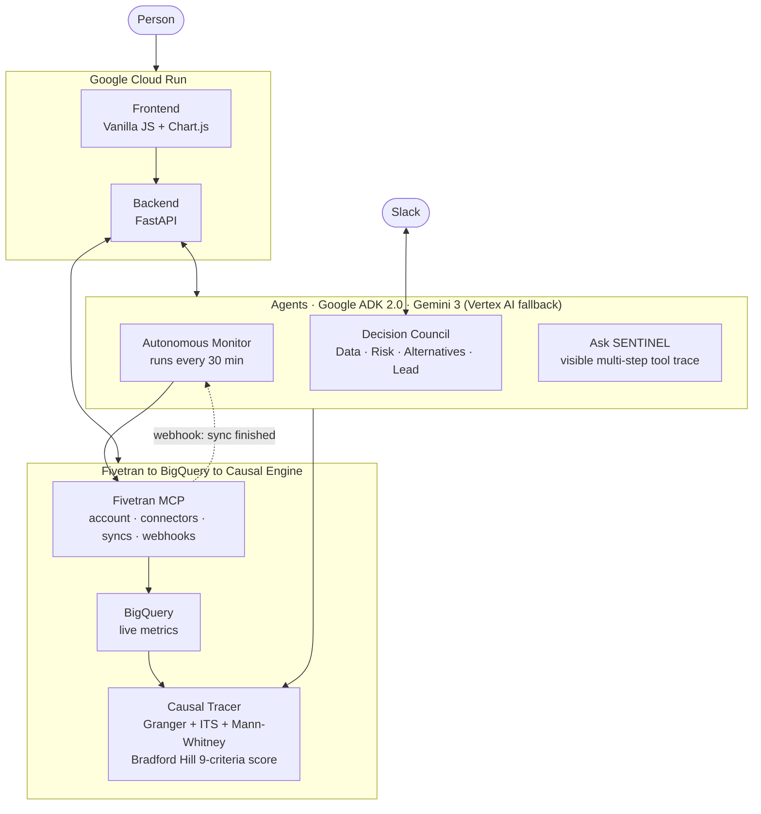

# SENTINEL: System Architecture

## How it works

Three things happen continuously, and they all draw on the same memory.

First, **SENTINEL watches your Fivetran-connected data.** Every 30 minutes (and instantly whenever Fivetran sends a "sync finished" webhook), it pulls fresh metrics out of BigQuery, checks them against known warning patterns, and, if something looks wrong, posts a warning to Slack with a drafted action plan before anyone has to ask.

Second, **SENTINEL listens for decisions.** When someone posts something like "raising prices 20% next quarter" in Slack, it recognizes the decision, pulls the live metrics that matter, and convenes four Gemini agents (one on data, one on risk, one on alternatives, one to make the final call) who debate it openly in the same thread before the decision is final. Whatever happens next, SENTINEL logs the decision together with a timestamped snapshot of every metric that mattered at that moment.

Third, when an outcome goes wrong months later, **SENTINEL can trace it back to the decision that caused it.** It doesn't eyeball a correlation. It runs three independent statistical tests (Granger causality, interrupted time series, Mann-Whitney U) and scores the result against the nine Bradford Hill criteria, a causal-inference framework borrowed from epidemiology. What comes out is a number you can interrogate, not a guess dressed up as an insight.

All three of these (watching, deciding, tracing) read and write the same Fivetran-to-BigQuery pipeline, so nothing is ever siloed or stale.

---

## Diagram

---

## What each piece does

**Google Cloud Run** hosts the whole thing: frontend and backend in one container that scales to zero when nobody's using it. The backend is FastAPI; the frontend is plain JavaScript with no framework and no build step, so anyone can read the source and see exactly what's rendered and what isn't.

**The agents** are built on Google's ADK (Agent Development Kit) and run on Gemini 3, with an automatic, self-reporting fallback to Gemini 2.5 on Vertex AI if Gemini 3 hits a quota wall. There are three of them:

- The **Autonomous Monitor** runs on a 30-minute schedule, plus instantly on a Fivetran webhook. It's the part of SENTINEL that keeps working even when nobody's looking at the dashboard.
- The **Decision Council** is four Gemini agents (Data, Risk, Alternatives, Lead) that debate a decision out loud in Slack before it gets made.
- **Ask SENTINEL** is a conversational ADK agent that answers questions about your decision history and shows its full reasoning chain (which tools it called, in what order, with what arguments) instead of hiding behind a single text answer.

**Fivetran, BigQuery, and the Causal Engine** make up the data backbone. SENTINEL doesn't read just one Fivetran endpoint. It drives the platform's account, group, connector, destination, and webhook surfaces through eleven separate MCP tools, triggers syncs on demand, and exchanges events with Fivetran in both directions. Once fresh data lands in BigQuery, the Causal Tracer takes over: three independent statistical tests look for a relationship between a decision date and how a metric behaved afterward, and the Bradford Hill scorer (nine criteria, a method that's been the standard in epidemiology since 1965) turns that into a single, defensible "how confident should you be that this decision caused this outcome" score.

---

## A real example

Here's what happens in the AcmeSaaS scenario, end to end:

1. Someone posts "raising prices 20%, NPS is at 31, is this smart?" in Slack
2. SENTINEL recognizes this as a pricing decision and pulls live NPS, churn, MRR, and ARR figures from BigQuery
3. The Decision Council convenes: Data Agent reports the numbers, Risk Agent flags that an NPS of 31 is in the bottom quartile for SaaS, Alternatives Agent proposes three lower-risk approaches, and Lead Agent recommends against the full increase, all visible in the same thread, in real time
4. The decision gets made anyway, and SENTINEL logs it together with a full snapshot of every metric at that exact moment
5. Thirty-four days later, churn climbs to 17% and ARR drops by $120K
6. Someone opens the Impact Trace. SENTINEL runs Granger causality, interrupted time series, and Mann-Whitney U against the logged decision date. All three agree there's a real signal, not noise
7. The Bradford Hill score comes back at 84% ("strong"), with 7 of 9 criteria met
8. The trace also surfaces what *else* could explain the drop (a competitor launch, a seasonal dip), so nobody mistakes a strong signal for an open-and-shut case

The point of the whole exercise: the data needed to have this conversation existed on day one. SENTINEL just made sure nobody could lose it.

---

## Causal analysis in detail

| Method | What it actually checks |
|---|---|
| Granger causality (lag-1 F-test) | Does knowing the decision date help predict the metric's later movement better than chance alone? |
| Interrupted time series | Did the metric's trend change right at the decision date, like a step rather than a gradual drift? |
| Mann-Whitney U | Are the "before" and "after" values genuinely different distributions, or just noise that looks different? |
| Bradford Hill scoring (9 criteria) | Combines strength, consistency, temporality, plausibility, and five other epidemiological tests into one 0 to 100% causal-confidence score with a plain-English label |

Every test runs independently and reports its own result. SENTINEL shows all three side by side rather than blending them into one number, because three independent methods agreeing is much stronger evidence than any single method on its own. And if they disagree, that disagreement is itself worth knowing about.

---

## Why we made the decisions we did

See [docs/adr/](adr/) for the reasoning behind SENTINEL's most consequential design choices:

- [ADR-0001](adr/0001-bradford-hill-causal-scoring.md): Why score causation with Bradford Hill instead of reporting a bare correlation number
- [ADR-0002](adr/0002-multi-agent-decision-council.md): Why four agents arguing in the open beat one agent handing down a verdict
- [ADR-0003](adr/0003-webhooks-and-polling.md): Why SENTINEL listens for webhooks *and* keeps polling every 30 minutes
- [ADR-0004](adr/0004-honest-liveness-reporting.md): Why every integration has to say, out loud, whether it's actually live
